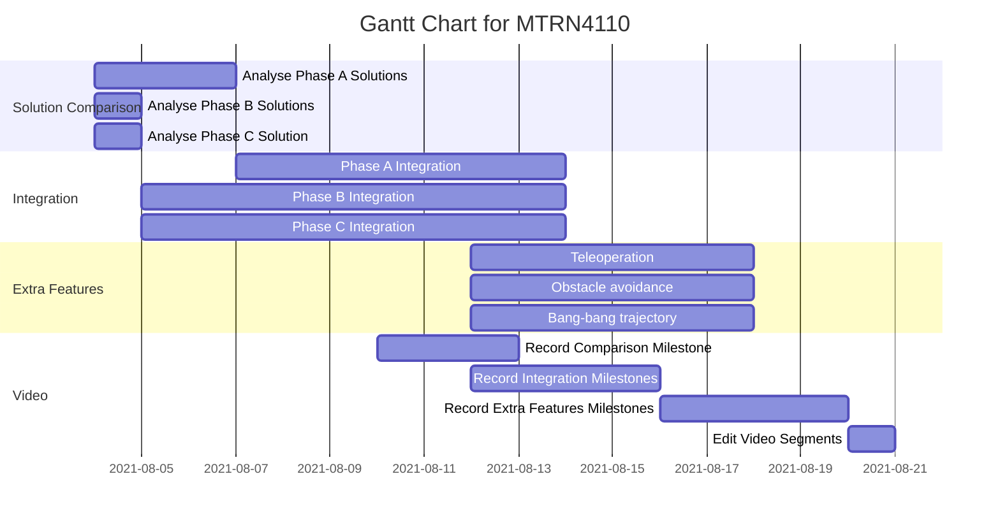

# Phase D

---

## Gantt Chart



---

## Python Setup

### Python 3.6 Installation

Note that only the pip package manager is required to install Python library requirements. This will allow Cython to link dependencies to Python libraries.

Linux:
```
sudo apt-get install python3.6
sudo apt-get install pip
```

Windows:

[Download link](https://www.python.org/ftp/python/3.6.0/python-3.6.0-amd64.exe)

Make sure pip will be installed in the wizard.

### Python Library Requirements

The following packages are required and listed in `requirements.txt`:
- `cython`
- `opencv-contrib-python`
- `numpy`

Linux:
```
pip install -r requirements.txt
```

Windows:
```
py -m pip install -r requirements.txt
```

---

## Build Instructions & Dependencies

<table>
<thead>
    <tr>
        <th>Build Step</th>
        <th>Build Instruction</th>
        <th>Dependency</th>
        <th>Dependency Setup</th>
        <th>Modifications Made</th>
    </tr>
</thead>
<tbody>
    <tr>
    </tr>
    <tr>
        <td rowspan="3">Compiling <code>.pyx</code> files</td>
        <td rowspan="3">Run <code>cython-build-script.sh</code><br>Ensure <code>CVPuckYou.h</code> and <code>CVPuckYou.c</code> are in their respective <code>include/</code> and <code>src/</code> folders</td>
        <td>cython</td>
        <td><code>pip install cython</code></td>
        <td>Add <code>-D_hypot=hypot</code> to <code>Makefile</code></td>
    </tr>
    <tr>
        <td>Ubuntu 18.04</td>
        <td><a href="https://docs.microsoft.com/en-us/windows/wsl/install-win10">WSL install instructions</a></td>
        <td></td>
    </tr>
    <tr>
        <td>Other Python imports</td>
        <td><code>pip install opencv-contrib-python</code><br><code>pip install numpy</code></td>
        <td></td>
    </tr>
    <tr>
        <td rowspan="4">Compiling <code>.hpp/.cpp/.h/.c</code> files</td>
        <td rowspan="4">Use Webots build tool</td>
        <td>Webots R2021a</td>
        <td><a href="https://cyberbotics.com/doc/guide/installation-procedure"> Webots install instructions</a></td>
        <td></td>
    </tr>
    <tr>
        <td><code>Python.h</code>, Python underlying <code>.h</code> files, Python libraries</td>
        <td>Provided in python3.6 folder for each OS</td>
        <td>Controller <code>Makefile</code> has been modified<br><code>python3.6/windows/include/pyconfig.h</code> has been modified</td>
    </tr>
    <tr>
        <td><code>python36.dll</code></td>
        <td>Provided for Windows</td>
        <td></td>
    </tr>
    <tr>
        <td></td>
        <td></td>
        <td></td>
    </tr>
</tbody>
</table>

### Tested Builds

The following platforms have been tested and are recommended:
- Webots R2021a on Windows 10 with WSL (Ubuntu 18.04).

---

## Run Instructions

1. File paths are defined in `Puck_You_MTRN4110_PhaseD.cpp`.
1. Select the `Puck_You_MTRN4110_PhaseD.cpp` file as the EPuck controller.
1. Execute the program using Webots' run tool.

---

## FAQ

### Why is there a python3.6 folder with header files and libs?

Python installations do not guarantee the location of these files on either Linux or Windows. Therefore to ensure successful compilation and execution of cython files into the C++ build, we keep a copy of these for each OS.

### Why is there a `#define _hypot hypot` at the top of main file or a `-D_hypot=hypot` in the `Makefile`?

In the Windows version of Webots in `Webots/msys64/mingw64/include/c++/10.2.0/cmath`, line 1124: `using ::hypot;`. `hypot` has been incorrectly defined and should be `_hypot`.

### Why do we use `PyImport_AppendInittab`?

The program will crash for python versions >= 3.5 and cython versions == 0.29.

### Why is there a `.dll` in `controllers/Puck_You_MTRN4110_PhaseD`?

Windows requires the dynamic library for cython `.c`/`.h` files to execute since cython `.c`/`.h` files are linked to python libraries.

### Why has [`pyconfig.h`](https://gitlab.com/puck-you/phase-d/-/blob/dev/python3.6/windows/include/pyconfig.h) in `python3.6/windows/include/` been modified?

See this issue: https://github.com/cython/cython/issues/3405
