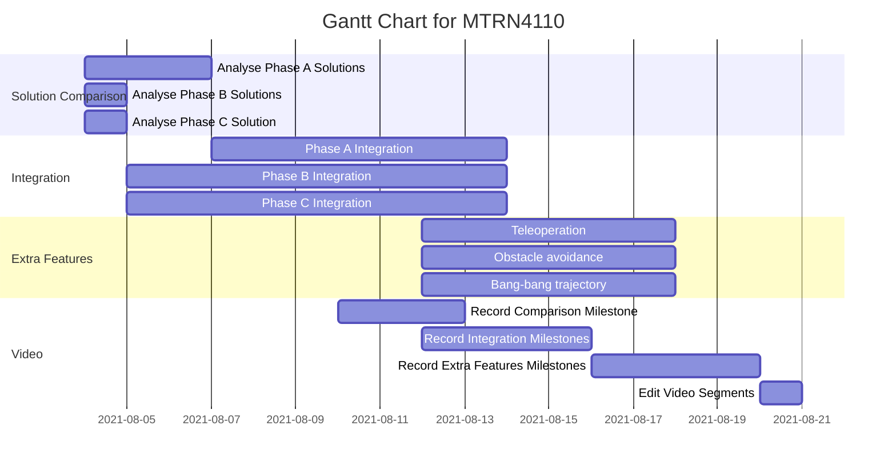

# Phase D

---

## Gantt Chart



---

## Python Setup

Python setup is required for all build steps.

### Python 3.7 Installation

Linux:
```
sudo apt-get install python3.7
sudo apt-get install pip
```

Windows:

[Get latest available Python 3.7 version](https://www.python.org/downloads/windows/)

### Python Library Requirements

The following packages are required and listed in `requirements.txt`:
- `cython`
- `opencv-contrib-python`
- `numpy`

Linux:
```
pip install -r requirements.txt
```

Windows:
```
py -m pip install -r requirements.txt
```

---

## Build Instructions & Dependencies

<table>
<thead>
    <tr>
        <th>Build Step</th>
        <th>Build Instruction</th>
        <th>Dependency</th>
        <th>Dependency Setup</th>
        <th>Modifications Made</th>
        <th>Tested On</th>
    </tr>
</thead>
<tbody>
    <tr>
    </tr>
    <tr>
        <td rowspan="1">Compiling <code>.pyx</code> files</td>
        <td rowspan="1"><code>python3 setup.py build_ext</code><br>Ensure <code>CVPuckYou.h</code> and <code>CVPuckYou.c</code> are in their respective <code>include/</code> and <code>src/</code> folders</td>
        <td>cython</td>
        <td><code>pip install cython</code></td>
        <td>Ubuntu 18.04 WSL, </td>
    </tr>
    <tr>
        <td rowspan="3">Compiling <code>.hpp/.cpp/.h/.c</code> files</td>
        <td rowspan="3">Use Webots build tool</td>
        <td>Webots R2021a</td>
        <td><a href="https://cyberbotics.com/doc/guide/installation-procedure"> Webots install instructions</a></td>
        <td>Add <code>-D_hypot=hypot</code> to <code>Makefile</code></td>
        <td></td>
    </tr>
    <tr>
        <td><code>Python.h</code>, Python underlying <code>.h</code> files, Python libraries</td>
        <td>Provided in python3.7 folder for each OS</td>
        <td><code>Makefile</code> has been modified to find <code>python3.7/</code><br><code>python3.7/windows/include/pyconfig.h</code> has been modified</td>
    </tr>
    <tr>
        <td><code>python36.dll</code></td>
        <td>Provided for Windows</td>
        <td></td>
    </tr>
</tbody>
</table>

### Tested Builds

The following platforms have been tested and are recommended:
- Webots R2021a on Windows 10 with WSL (Ubuntu 18.04).

---

## Run Instructions

1. File paths are defined in `Util.hpp`.
1. Select the `Puck_You_MTRN4110_PhaseD.cpp` file as the EPuck controller.
1. Execute the program using Webots' run tool.

---

## FAQ

### Why is there a python3.7 folder with header files and libs?

Python installations do not guarantee the location of these files on either Linux or Windows. Therefore to ensure successful compilation and execution of cython files into the C++ build, we keep a copy of these for each OS.

### Why am I getting an undefined `hypot` during Webots compilation?

If you are getting the following error:
```
C:/Program\ Files/Webots/msys64/mingw64/include/c++/10.2.0/cmath:1124:11: error: '::hypot' has not been declared...
```

This is a `mingw64` problem where `hypot` has been incorrectly defined/used. To fix this, add a `#define _hypot hypot` before all `#include` at the top of the main file or add the `-D_hypot=hypot` compiler flag in the `Makefile`?

### Why do we use `PyImport_AppendInittab`?

The program will crash for python versions >= 3.5 and cython versions == 0.29.

### Why am I getting a missing `python37.dll` error on Windows?

If you are getting this error:
```
The code execution cannot proceed because python37.dll was not found. Reinstalling the program may fix this problem.
```

Ensure there exists a `python37.dll` file with the Windows executable that Webots is targetting. Windows requires the dynamic library to execute since `Python.h` is linked to python libraries.

### Why am I getting a division by zero error during Webots compilation?

If you are getting these errors:
```
src/your_file.cpp:203:41: warning: division by zero [-Wdiv-by-zero]
  203 |     enum { __pyx_check_sizeof_voidp = 1 / (int)(SIZEOF_VOID_P == sizeof(void*)) };
      |                                       ~~^~~~~~~~~~~~~~~~~~~~~~~~~~~~~~~~~~~~~~~
src/your_file.cpp:203:79: error: division by zero is not a constant expression
  203 |     enum { __pyx_check_sizeof_voidp = 1 / (int)(SIZEOF_VOID_P == sizeof(void*)) };
      |                                                                               ^
src/your_file.cpp:203:41: error: '(1 / 0)' is not a constant expression
  203 |     enum { __pyx_check_sizeof_voidp = 1 / (int)(SIZEOF_VOID_P == sizeof(void*)) };
      |                                       ~~^~~~~~~~~~~~~~~~~~~~~~~~~~~~~~~~~~~~~~~
src/your_file.cpp:203:79: error: enumerator value for '__pyx_check_sizeof_voidp' is not an integer constant
  203 |     enum { __pyx_check_sizeof_voidp = 1 / (int)(SIZEOF_VOID_P == sizeof(void*)) };
```

The following lines must be added to the top of `python3.7/windows/include/pyconfig.h`:
```
#ifdef __MINGW32__
    #ifdef _WIN64
        #define MS_WIN64
    #endif
#endif
```

See this issue: https://github.com/cython/cython/issues/3405

Also check your code to safe-guard against dividing by zero cases.
