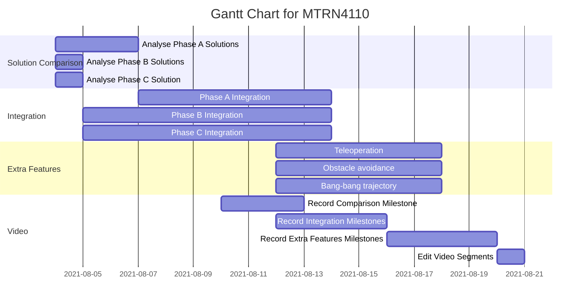

# Phase D

## Gantt Chart



## Python 3.6 Installation

Linux:
```
sudo apt-get install python3.6
```

Windows:

[Download link](https://www.python.org/ftp/python/3.6.0/python-3.6.0-amd64.exe)

## Python Requirements

Linux:
```
pip install -r requirements.txt
```

Windows:
```
py -m pip install -r requirements.txt
```

## Cython Installation

Linux:
```
pip install cython
```

## Build Instructions

`.pyx` files currently should be compiled on Ubuntu by running `cython-build-script.sh`. The option to compile on other OS has not been explored.

## FAQ

### Why is there a python3.6 folder with header files and libs?

Python installations do not guarantee the location of these files on either Linux or Windows. Therefore to ensure successful compilation and execution of cython files into the C++ build, we keep a copy of these for each OS.

### How do I compile the `.pyx` code with the C++ code?

1. Ensure cython is installed.
1. Run `cython-build-script.sh`
1. Run build in Webots.

### Why is there a `#define _hypot hypot` at the top of main file?

In the Windows version of Webots in `Webots/msys64/mingw64/include/c++/10.2.0/cmath`, line 1124: `using ::hypot;`. `hypot` has been incorrectly defined and should be `_hypot`.

### Why do we use `PyImport_AppendInittab`?

The program will crash for python versions >= 3.5 and cython versions == 0.29.

### Why is there a `.dll` in `controllers/Puck_You_MTRN4110_PhaseD`?

Windows requires the dynamic library for cython `.c`/`.h` files to execute since cython `.c`/`.h` files are linked to python libraries. Cython `.c`/`.h` files after-all are still interpretted and cannot be made python-independent.