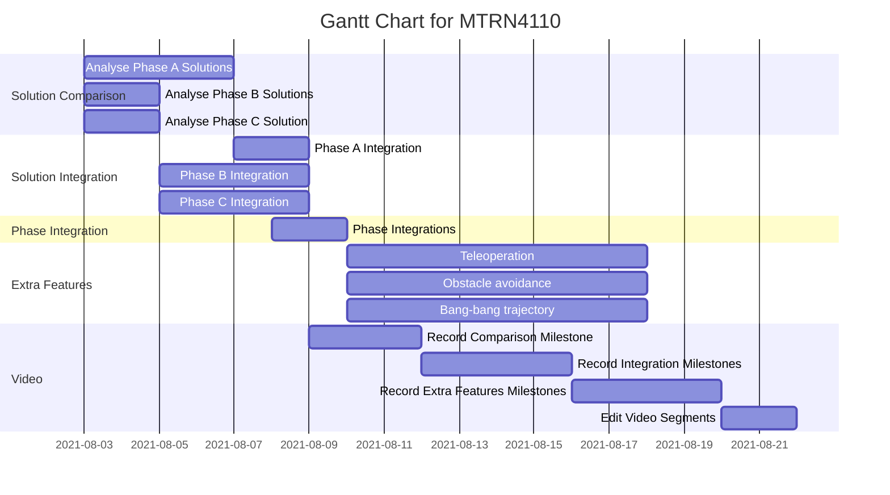

# Phase D

## Gantt Chart

```mermaid
gantt
    title Gantt Chart for MTRN4110
    dateFormat  DD-MM-YYYY
    section Solution Comparison
    Analyse Phase A Solutions       :03-08-2021, 07-08-2021
    Analyse Phase B Solutions       :03-08-2021, 05-08-2021
    Analyse Phase C Solution        :03-08-2021, 05-08-2021

    section Solution Integration
    Phase A Integration             :07-08-2021, 2d
    Phase B Integration             :05-08-2021, 4d
    Phase C Integration             :05-08-2021, 4d

    section Phase Integration
    Phase Integrations              :08-08-2021, 2d

    section Extra Features
    Teleoperation              :10-08-2021, 8d
    Obstacle avoidance         :10-08-2021, 8d
    Bang-bang trajectory       :10-08-2021, 8d

    section Video
    Record Comparison Milestone           :09-08-2021, 3d
    Record Integration Milestones         :12-08-2021, 4d
    Record Extra Features Milestones      :16-08-2021, 4d
    Edit Video Segments                   :20-08-2021, 2d
```
